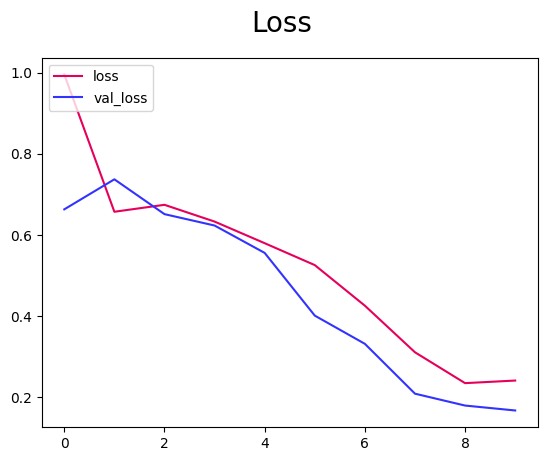
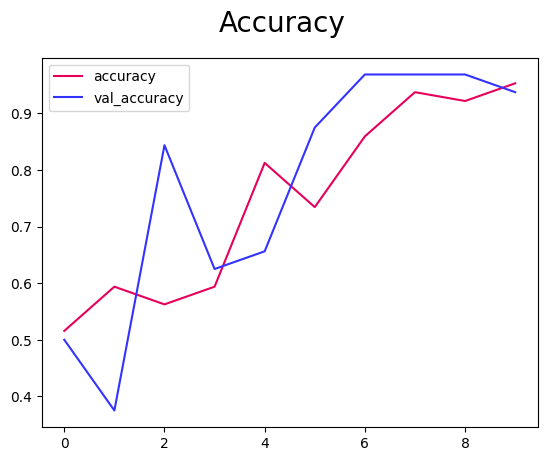

# Model Building Results:

### Set Up Pass:
Model trained with only 32 total screenshots.

- batch size: 5
- train: 4, Val: 2, test:  1
- Precision: 0.0, Recall: 0.0, Accuracy: 0.5 
- model optimizer: [Adam](https://www.tensorflow.org/api_docs/python/tf/keras/optimizers/Adam) 
Adaptive Moment Estimation

- Test Failed: test-person-screenshot-2024-01-28T06-02-38.727Z.png ***has no person in it*** 

### 1st Pass (All Test Passed):
Model trained with only 97 total screenshots.

- batch size  16
- train: 4, Val: 2, test:  1
- Precision: 0.0, Recall: 0.0, Accuracy: 1.0 
- epochs: 10 
- model optimizer: [Adam](https://www.tensorflow.org/api_docs/python/tf/keras/optimizers/Adam) 
Adaptive Moment Estimation

- Test Passed: ./image_scrape_code/test_images/test-screenshot-2024-01-29T00-46-02.043Z.png **has no person in it**

