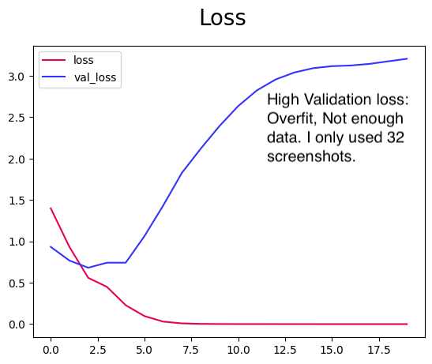

# Model Building Results:

### Set Up Pass:
Model trained with only 32 total screenshots.
- batches of 5
- train: 4, Val: 2, test:  1
- Precision: 0.0, Recall: 0.0, Accuracy: 0.5 
- model optimizer: [Adam](https://www.tensorflow.org/api_docs/python/tf/keras/optimizers/Adam) 
Adaptive Moment Estimation
Test Failed: test-person-screenshot-2024-01-28T06-02-38.727Z.png ***has no person in it*** 

